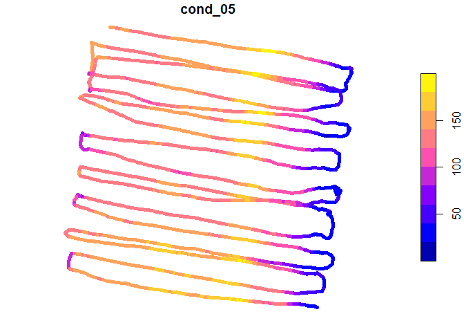

<!-- README.md is generated from README.Rmd. Please edit that file -->
em38
====

em38 translates \*.n38 binary files generated by the [Geonics EM38-MKII ground conductivity meter](http://geonics.com/html/em38.html), commonly used in soil research and precision agriculture. EM38 devices are supported by an official translation app called DAT38MK2, but this lacks a command-line interface and is not easy to use in a reproducible workflow. This package can output a decoded \*.M38-formatted text file as described in the EM38-MKII's manual, or an `sf` point spatial object.

Installation
------------

Install development versions from github with

``` r
library(devtools)
install_github("obrl-soil/em38")
```

This package is in early development phase. Improving its reliability requires access to a wide variety of test datasets, so if you have an \*.n38 file that fails to decode correctly, please consider sending it to me. I have been able to test decoding on around 50 sample files from two different EM38-MKII devices, but could always use more. The device and its logger have a large number of possible setting combinations, and have not seen all of them. Additionally, a third-party GPS needs to be attached to the device and its data-logger, and GPS output data are notoriously variable by brand and model.

Usage
-----

em38 is accompanied by a demo dataset:

``` r
library(em38)
# import binary file as raw() type matrix
n38_mat     <- n38_import(system.file("extdata", "em38_demo.n38", package = "em38"))
# break matrix into sections according to file spec 
n38_chunks  <- n38_chunk(n38_mat)
# decode matrix chunks into useable data
n38_decoded <- n38_decode(n38_chunks)

# output an m38 file (comparable to official decode)
m38_example <- n38_to_m38(n38_decoded)
# write to file as e.g. write(m38_example, paste0('m38_from_R_', Sys.Date(), '.m38'))

# spatialise the decoded data
em38_sf  <- em38_spatial(n38_decoded, out_mode = 'Vertical')

# Plot spatialised output (calibrated conductivity for coil separation 0.5m)
plot(em38_sf['cond_05'], pch = 20)
```


